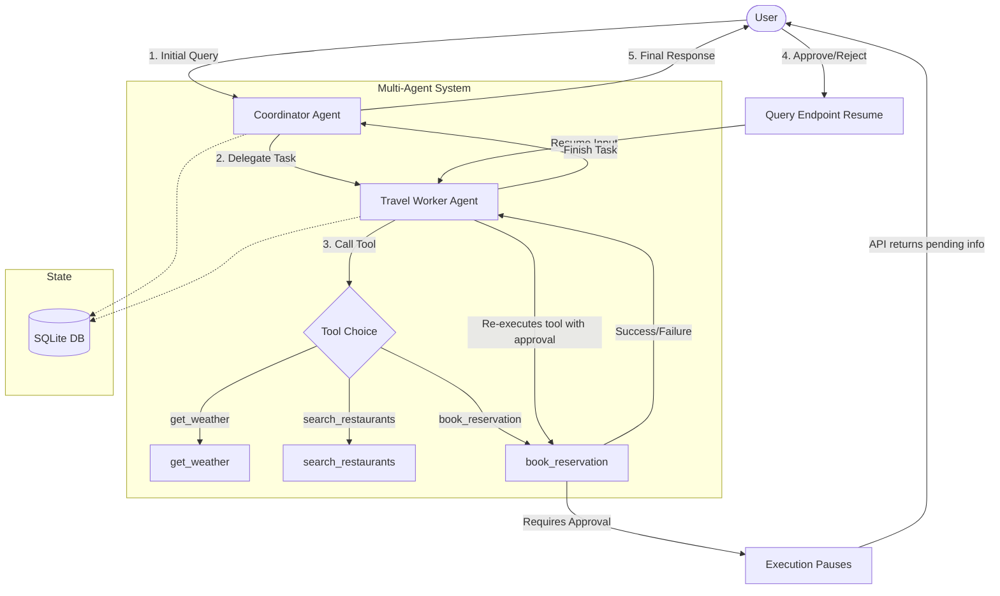

# Mini-Concierge Travel & Activity Planner

A lightweight Python agent built using the Google Agent Development Kit (ADK) to demonstrate core agentic patterns: multi-agent orchestration, tool calling, state management, and Human-in-the-Loop (HITL) execution.

This project is designed to satisfy the evaluation criteria for the "5 Days of AI" program.

---

## 🧭 Architecture

The system uses a **Coordinator-Worker** pattern:
1.  **Coordinator Agent**: Receives the user request, plans the itinerary, and delegates sub-tasks.
2.  **Travel Worker Agent**: Executes specific tools to gather information and perform actions.



### Tools
*   `get_weather(city, date)`: Returns simulated weather info.
*   `search_restaurants(city, cuisine)`: Searches mock data, matching against user preferences stored in session state.
*   `book_reservation(restaurant_name, time)`: Simulates a booking. **Requires Human-in-the-Loop approval** before execution.

---

## 🛠️ Tech Stack & Concepts Demonstrated

*   **Framework**: `google-adk` (Python)
*   **Orchestration**: Multi-agent delegation
*   **State & Memory**: SQLite persistence (`DatabaseSessionService`) and history compaction.
*   **Observability**: Structured JSON logging of agent intent and tool outcomes.
*   **Security**: Gemini API key loaded via environment variables / Secret Manager.
*   **Infra**: Terraform deployment configuration.

---

## 🚀 Setup & Execution

### 📋 Prerequisites
*   Python 3.13 or higher
*   A Gemini API Key (get one from [Google AI Studio](https://aistudio.google.com/))

### ⚙️ Installation & Configuration

1.  **Clone the repository**:
    ```bash
    git clone https://github.com/pselamy/mini-concierge-agent.git
    cd mini-concierge-agent
    ```

2.  **Create and activate a virtual environment**:
    ```bash
    python -m venv .venv
    source .venv/bin/activate
    ```

3.  **Install dependencies**:
    ```bash
    pip install --upgrade pip
    pip install -r requirements.txt
    ```

4.  **Set your Gemini API Key**:
    ```bash
    export GEMINI_API_KEY="your_actual_api_key_here"
    ```

### 🏃 Running the Application

Start the FastAPI local development server:
```bash
uvicorn app.main:app --reload
```
The server will start at `http://localhost:8000`.

### 🧪 Running Tests

To run the test suite with coverage enforcement:
```bash
PYTHONPATH=. pytest --cov=app tests/
```

### 📬 Interaction Flow Example

Here is how to interact with the API endpoints to test the Human-in-the-Loop flow.

#### Step 1: Initial Request (Starts booking, pauses for approval)
Send a query that triggers the booking tool:
```bash
curl -X POST http://localhost:8000/query \
  -H "Content-Type: application/json" \
  -d '{"user_id": "user123", "session_id": "session456", "query": "Book Gino\u0027s East at 7 PM."}'
```
**Expected Response**:
```json
{
  "status": "paused",
  "message": "Requires human approval",
  "session_id": "session456",
  "invocation_id": "e-12345678-abcd-1234-abcd-1234567890ab",
  "approval_info": {
    "approval_id": "adk-7c5c7c9f-427f-4079-b99f-c3c57ce3a603",
    "hint": "Confirm booking at Gino's East for 7 PM?"
  }
}
```

#### Step 2: Resume Request (Approve the booking)
Use the `invocation_id` and `approval_id` from the previous response to resume:
```bash
curl -X POST http://localhost:8000/query \
  -H "Content-Type: application/json" \
  -d '{
    "user_id": "user123",
    "session_id": "session456",
    "invocation_id": "e-12345678-abcd-1234-abcd-1234567890ab",
    "approval_response": {
      "approval_id": "adk-7c5c7c9f-427f-4079-b99f-c3c57ce3a603",
      "confirmed": true
    }
  }'
```
**Expected Response**:
```json
{
  "status": "success",
  "response": "I have successfully booked Gino's East for you at 7 PM."
}
```

